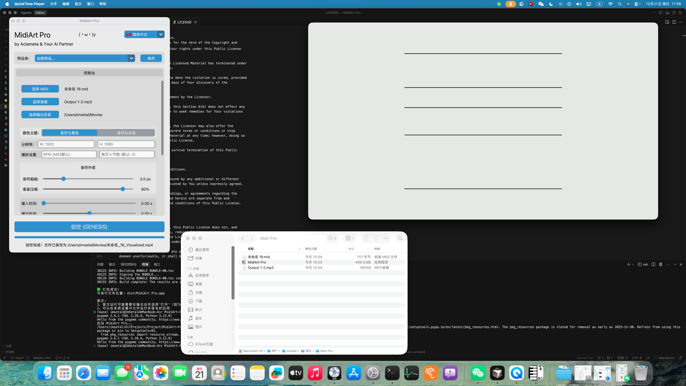

# MidiArt-Pro

一个强大且可定制的MIDI音乐可视化工具，将你的音乐变成艺术。



## 原仓库

本项目基于 [Aclameta/MidiArt-Pro](https://github.com/Aclameta/MidiArt-Pro) 的 macOS 版本。

**原作者：**
- GitHub: [@Aclameta](https://github.com/Aclameta)
- B站: [Aclameta](https://space.bilibili.com/109275196)

[English](README_EN.md)

## 系统要求

- macOS 10.13 或更高版本

## 运行方法

### 从发布页下载运行（推荐）

1. 前往 [Releases 页面](https://github.com/ImSetal121/MidiArt-Pro-MacOS/releases) 下载最新版本
2. 下载最新的 `MidiArt_Pro_*_macOS.zip` 文件（* 表示版本号）
3. 解压压缩包
4. 双击 `MidiArt Pro.app` 即可运行

**重要提示：**
- 首次运行：如果看到安全警告，请右键点击应用并选择"打开"，然后在对话框中点击"打开"
- 应用未签名，可能需要在"系统设置 > 隐私与安全性"中允许运行

**音频格式支持：**
- 支持 **MP3** 和 **WAV** 格式的音频文件
- 推荐使用 **MP3 格式** 以获得更好的兼容性
- 如果使用 WAV 格式遇到问题，请查看调试日志

### 源码运行方式

如果你想从源码运行或进行开发：

**系统要求：**
- macOS 10.13 或更高版本
- Python 3.9 或更高版本（推荐使用 Homebrew 安装）
- Homebrew（用于安装 python-tk，脚本会自动处理）

**运行步骤：**

1. 克隆或下载本项目
2. 在终端中进入项目目录
3. 运行启动脚本：

```bash
chmod +x run.sh
./run.sh
```

脚本会自动：
- 检查并安装 python-tk（Tkinter 支持，如果缺失）
- 检查并创建 Python 虚拟环境
- 安装所需依赖
- 启动应用

**注意：**
- 如果首次运行时检测到缺少 Tkinter 支持，脚本会自动通过 Homebrew 安装 `python-tk`
- 安装完成后需要重新运行脚本
- 如果遇到权限问题，请确保已安装 Homebrew

**许可证提示：**
- 本项目采用 [CC BY-NC-SA 4.0](LICENSE) 许可证
- 使用源码时请遵守许可证规则：署名、非商业使用、相同方式共享
- 详细条款请查看 [LICENSE](LICENSE) 文件

## 打包方法

```bash
chmod +x build_macos.sh
./build_macos.sh
```

打包完成后，应用位于 `dist/MidiArt Pro.app`

**重要提示：**
- 首次运行可能需要右键点击并选择"打开"（因为未签名）
- 可以在系统设置中允许运行未签名的应用

**调试信息：**
如果需要查看控制台输出和调试信息，请直接运行可执行文件：
```bash
"dist/MidiArt Pro.app/Contents/MacOS/MidiArt Pro"
```
注意：如果通过 Finder 双击打开或使用 `open` 命令，控制台窗口不会显示。错误日志会保存到 `~/MidiArt_Pro_error.log` 和 `~/MidiArt_Pro_debug.log`

## 依赖

**系统依赖：**
- python-tk（通过 Homebrew 安装，脚本会自动处理）

**Python 依赖：**
主要依赖包括：
- mido
- opencv-python
- moviepy
- customtkinter（需要 Tkinter 支持）
- pygame
- librosa
- numpy

完整依赖列表请查看 `requirements.txt`
